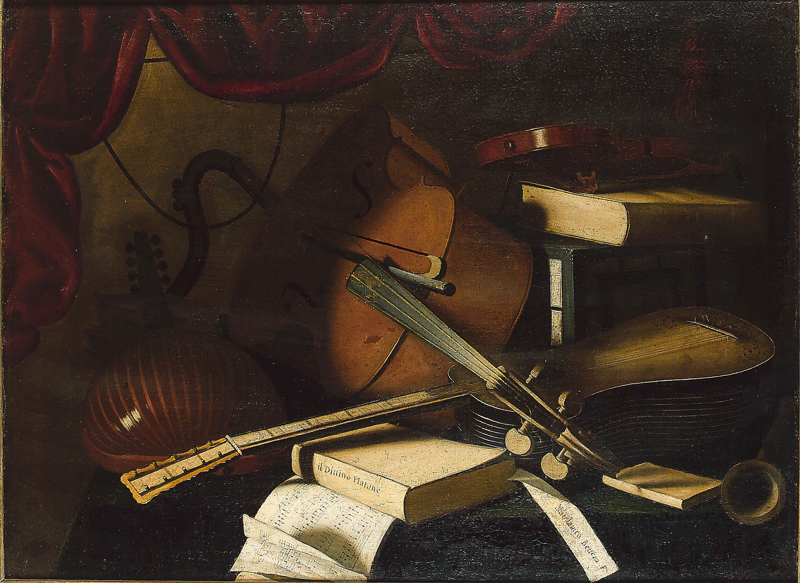

The Brandenburgs are where I keep landing when I want orchestral
Bach. Each one sounds like a different ensemble; the boldness of the
fifth, with its harpsichord cadenza, isn't typical of the rest.

## Background

Bach presented this collection of six instrumental works to
Christian Ludwig, Margrave of Brandenburg-Schwedt, in 1721, though
many pieces were probably composed earlier. The dedication, written
in French, reveals Bach's respectful tone as he offered these
compositions after having performed for the margrave in Berlin a
few years prior. Bach compiled the manuscript almost entirely in
his own hand, an unusual practice that underscores the work's
significance to him.

*Photo by Workshop of Bartolomeo Bettera, licensed under Public domain, from [Wikimedia Commons](https://commons.wikimedia.org/wiki/File:Studio_of_Bartolomeo_Bettera_-_A_lute,_cello,_violin,_guitar,_musical_manuscript_and_books_on_a_draped_table.jpg).*

## On the orchestration

The concertos are celebrated for their innovative use of varied
instrumental combinations, with each piece featuring different solo
instruments alongside the ensemble. Scholar Christoph Wolff noted
that Bach employed "the widest imaginable spectrum of orchestral
instruments," with each concerto establishing a unique scoring
precedent. From the natural horns and oboes of the first concerto
to the harpsichord's prominent virtuosic role in the fifth, Bach
demonstrated remarkable creativity in orchestration.

## My current listening

The Pinnock / English Concert recording is the one I keep coming
back to — period instruments, brisk tempi, but never rushed. The
Karajan version is gorgeous but feels overdressed compared to it.

---

*Body excerpts adapted from Wikipedia, [Brandenburg Concertos](https://en.wikipedia.org/wiki/Brandenburg_Concertos), licensed under [CC BY-SA 4.0](https://creativecommons.org/licenses/by-sa/4.0/).*
