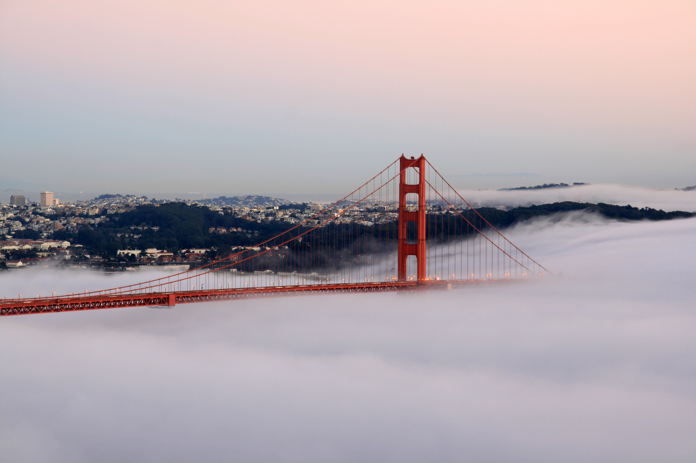

# Vertigo

> [!note]
> Often cited as Hitchcock's masterpiece, though it took decades
> to acquire that reputation. The 1958 release got mixed reviews;
> by the 2012 Sight & Sound poll it was the top film ever made.
## Plot setup

James Stewart plays a retired San Francisco detective forced back
into service when a college acquaintance asks him to investigate
his wife's strange behavior. What begins as a surveillance
assignment transforms into a compelling psychological mystery as
the detective becomes increasingly drawn to the woman he's been
hired to follow, leading him through the city's landmarks and
culminating in tragedy at a historic mission.

*Photo by Brocken Inaglory, licensed under CC BY-SA 3.0, from [Wikimedia Commons](https://commons.wikimedia.org/wiki/File:Golden_Gate_Bridge_at_sunset_1.jpg).*

## San Francisco as character

San Francisco itself becomes a character in the film, with
Hitchcock extensively filming on location throughout the city and
its surrounding areas. Iconic sites like the Golden Gate Bridge,
Mission San Juan Bautista, and various neighborhoods serve as
crucial backdrops. The production moved between real locations and
Paramount Studios, allowing Hitchcock to blend authentic settings
with controlled studio environments to achieve his precise visual
vision.

> [!tip] Watching tip
> The first hour plays as a conventional missing-person mystery.
> The film's reputation rests on what happens after — but going
> in cold is the recommended approach.
> [!warning] Spoilers
> There's a structural twist about two-thirds through. The
> Wikipedia article spoils it in its second sentence; if you're
> being careful, watch the film before reading anything else
> about it.
## Reception

Upon its 1958 release, critical response proved mixed rather than
celebratory. While some reviewers praised Hitchcock's technical
mastery and the film's visual sophistication, others felt the
narrative took too long to unfold and bogged down in a maze of
detail. The film's reputation underwent dramatic transformation in
subsequent decades, eventually achieving recognition as a
masterpiece and ranking at the top of prestigious critics' polls
by 2012.

---

*Body excerpts adapted from Wikipedia, [Vertigo (film)](https://en.wikipedia.org/wiki/Vertigo_(film)), licensed under [CC BY-SA 4.0](https://creativecommons.org/licenses/by-sa/4.0/).*
